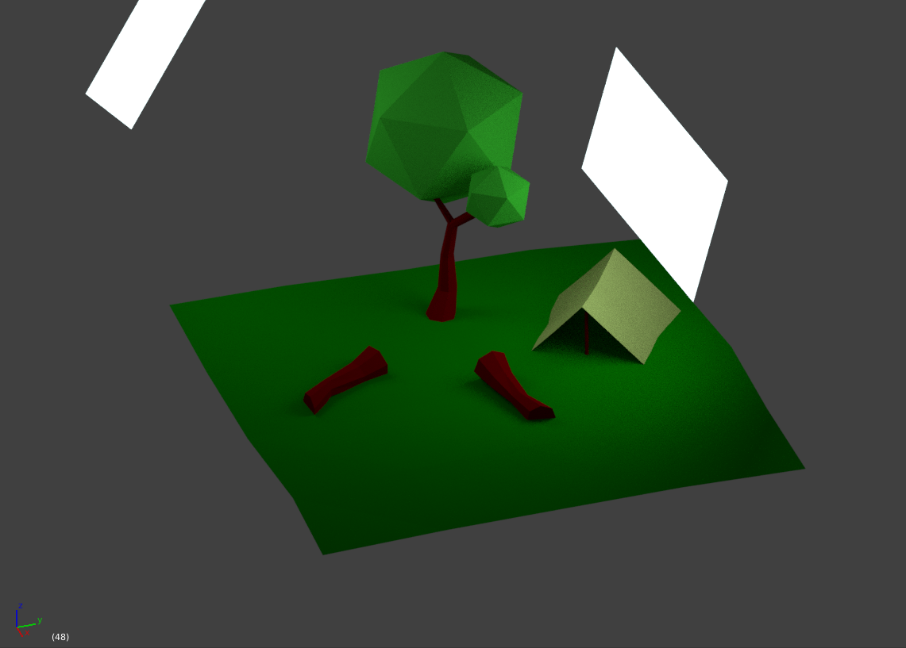

Creating a game with Godot. Started with this tutorial:
[How to make a 3D platformer in Godot in 8 minutes](https://www.youtube.com/watch?v=1I3z5ZpBOmc)

Development roadmap:
* Movement 
    * Flesh out player movement
        * Jumping
    * Attack
    	* Basic melee attack
	* Basic ranged attack
* Interaction
    * Interact with object (i.e. chest, sign)
    * Interact with NPC (dialogue)

Things I'm going to want to look into for this project:
* [Using gridmaps](http://docs.godotengine.org/en/3.1/tutorials/3d/using_gridmaps.html)
* [Animating lots of things at once](http://docs.godotengine.org/en/3.1/tutorials/3d/vertex_animation/index.html)

